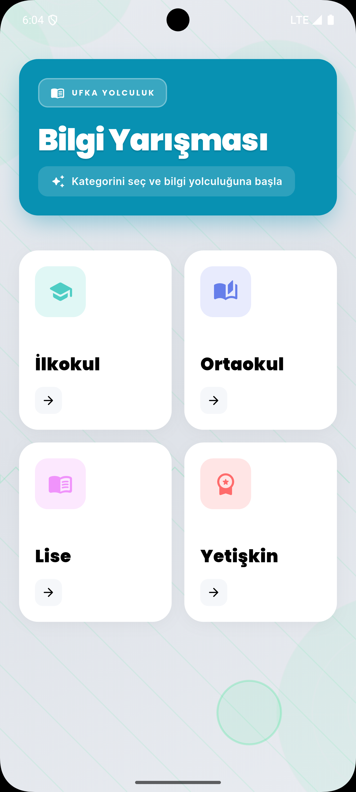
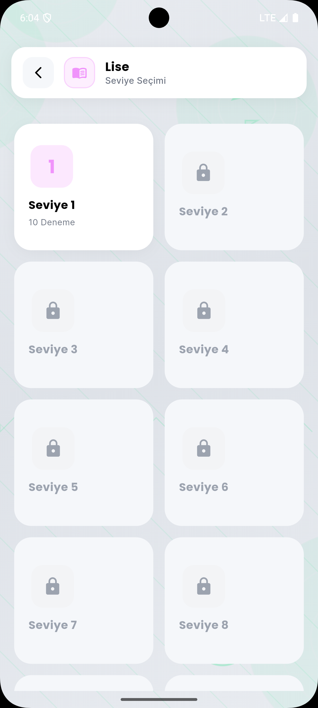
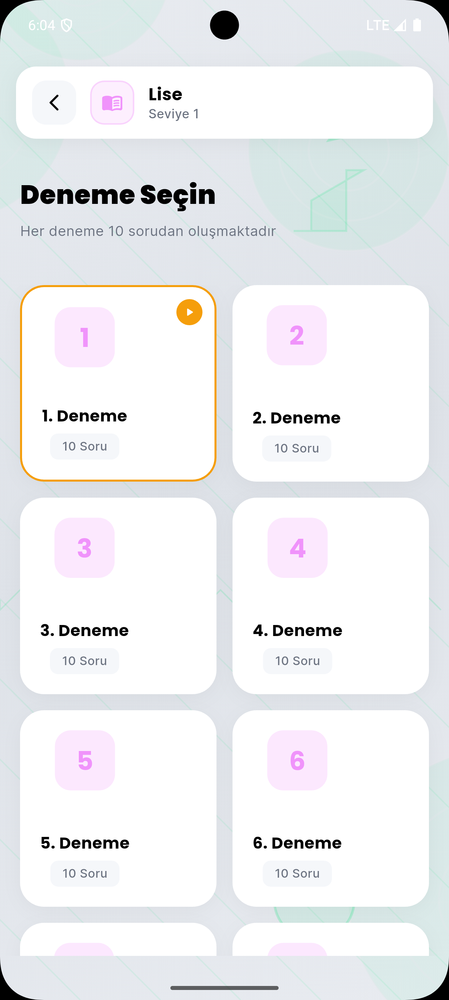
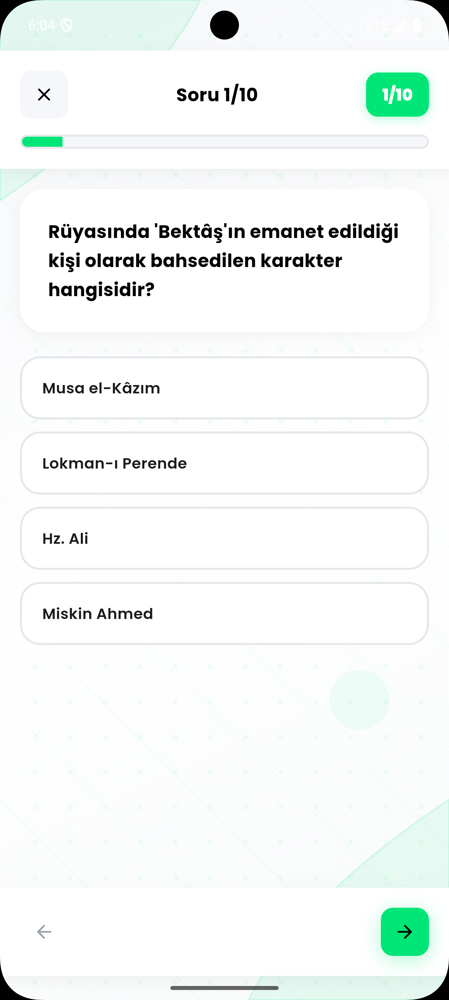
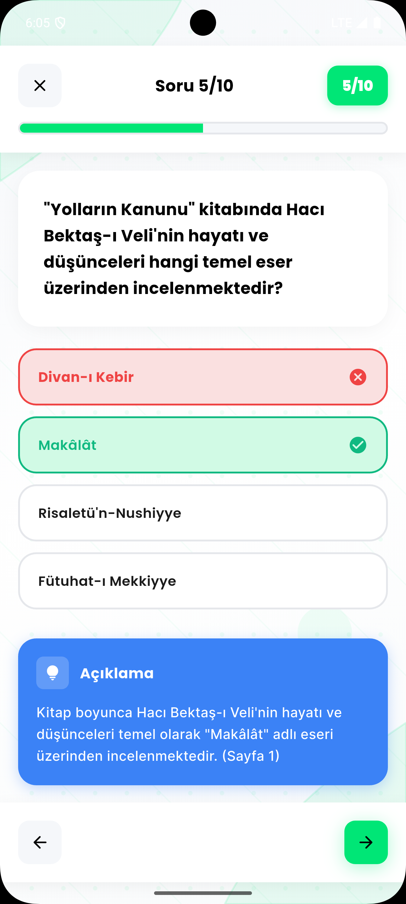
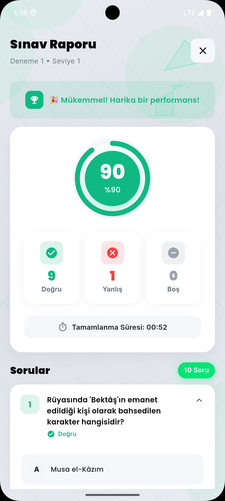

# Journey to the Horizon - Knowledge and Culture Competition

> [Türkçe versiyon için tıklayın](README.md)

A personal mobile application project inspired by the 12th Journey to the Horizon Knowledge and Culture Competition. Designed for various age groups, this application aims to provide an interactive learning experience with questions prepared from the works "Maske Düştü", "Zamansızlar Mektebi - Hak Muhafızları", "Yolların Kanunu", and "İncinsen de İncitme".

## Screenshots

<p align="center">
  
  
  
</p>

<p align="center">
  
  
  
</p>

## About the Project

This application is a personal project developed to experience the 12th Journey to the Horizon Knowledge and Culture Competition on mobile platforms. It aims to measure knowledge and cultural level with educational content addressing different age groups. The app attempts to provide an enjoyable learning experience through interactive questions designed in a competition format.

## Source Works

The application content is prepared from the following works:

| Category | Work | Target Audience |
|----------|------|-----------------|
| Elementary | Maske Düştü | Ages 6-10 |
| Middle School | Zamansızlar Mektebi - Hak Muhafızları | Ages 11-14 |
| High School | Yolların Kanunu | Ages 15-18 |
| Adult | İncinsen de İncitme | Ages 18+ |

### Content Generation

Questions, answers, and explanations in the application were prepared from the above works using artificial intelligence technology. Each question set is created while remaining faithful to the content of the relevant book and at an appropriate difficulty level for the target age group.

## Features

**Categories and Difficulty Levels**
- 4 different categories: Elementary, Middle School, High School, and Adult
- 3 difficulty levels in each category: Easy, Medium, and Hard
- Category-based progress tracking
- Progressive advancement with level lock system

**Quiz Features**
- 10 multiple-choice questions per exam
- Timed exam mode
- Instant feedback and explanations
- Detailed result report
- Correct/incorrect answer statistics

**User Experience**
- Modern and user-friendly interface
- Dark and light theme support
- Interactive experience with sound effects
- Smooth animations
- Offline support

**Progress System**
- Locked/unlocked levels based on completed exams
- Score and performance tracking
- Exam history
- 10 different trials at each level

## Technical Information

**Development Environment**
- Framework: Flutter 3.2.3+
- Language: Dart 3.0+
- Minimum SDK: Android API 21, iOS 12.0

**Libraries Used**
- State Management: Provider
- Local Storage: SharedPreferences
- Fonts: Google Fonts (Poppins, Inter)
- Animations: AnimateDo, Shimmer, Flutter Staggered Animations
- Audio: AudioPlayers
- Ads: Google Mobile Ads

```yaml
dependencies:
  provider: ^6.1.2
  shared_preferences: ^2.2.3
  google_mobile_ads: ^5.1.0
  google_fonts: ^6.2.1
  audioplayers: ^6.0.0
  animate_do: ^3.3.4
  shimmer: ^3.0.0
  flutter_staggered_animations: ^1.1.1
```

## Installation

### Requirements

- Flutter SDK 3.2.3 or higher
- Dart SDK 3.0.0 or higher
- Android Studio or Xcode (platform dependent)

### Installation Steps

1. Clone the repository:
```bash
git clone https://github.com/YusufAlper17/ufka-yolculuk-quiz.git
cd ufka-yolculuk-quiz
```

2. Install dependencies:
```bash
flutter pub get
```

3. Run the application:
```bash
flutter run
```

For detailed installation information, please refer to [SETUP_GUIDE.md](SETUP_GUIDE.md).

### Firebase Configuration (Optional)

Firebase configuration is required to use the ad feature:
- Add `google-services.json` file to `android/app/` directory
- Add `GoogleService-Info.plist` file to `ios/Runner/` directory

## Project Structure

```
lib/
├── core/
│   ├── constants/       # Application constants
│   ├── providers/       # Global state management
│   └── theme/          # Theme and color definitions
├── modules/
│   ├── home/           # Home page - Category selection
│   ├── level/          # Level selection
│   ├── exam/           # Exam selection
│   └── quiz/           # Quiz and result screens
│       ├── models/     # Data models
│       └── widgets/    # Custom widgets
├── services/           # Service layer
└── main.dart          # Application entry point

assets/
├── data/              # Question database (JSON)
├── icon/              # Application icon
├── images/            # Images
└── sounds/            # Sound files
```

## Data Structure

Questions are stored in JSON format in the `assets/data/processed_questions.json` file:

```json
{
  "elementary": {
    "easy": [
      {
        "question": "Question text",
        "options": ["Option A", "Option B", "Option C", "Option D"],
        "correct_answer": 0,
        "difficulty": "easy",
        "explanation": "Answer explanation"
      }
    ],
    "medium": [...],
    "hard": [...]
  },
  "middle_school": {...},
  "high_school": {...},
  "adult": {...}
}
```

## Build

### Android

Build APK:
```bash
flutter build apk --release
```

Build App Bundle (for Google Play):
```bash
flutter build appbundle --release
```

### iOS

```bash
flutter build ios --release
```

## Contributing

If you would like to contribute to the project, please review [CONTRIBUTING.md](CONTRIBUTING.md).

### Contribution Process

1. Fork the project
2. Create a feature branch (`git checkout -b feature/new-feature`)
3. Commit your changes (`git commit -m 'feat: add new feature'`)
4. Push your branch (`git push origin feature/new-feature`)
5. Create a Pull Request

### Development Guidelines

- Follow Flutter/Dart code standards
- Add documentation for new features
- Open an issue first for major changes

## Bug Reports

If you find a bug, please [open an issue](https://github.com/YusufAlper17/ufka-yolculuk-quiz/issues) and include:
- Detailed description of the bug
- Steps to reproduce the bug
- Expected and actual behavior
- Screenshots (if applicable)
- Device and platform information

## License

This project is licensed under [Creative Commons Attribution-NonCommercial-ShareAlike 4.0 International License](LICENSE) (CC BY-NC-SA 4.0).

**License Summary:**
- Source code can be freely used, modified, and shared
- **Cannot be used for commercial purposes** (requires developer permission)
- Modified versions must be shared under the same license
- Attribution must be given (developer must be credited)
- Free for educational, research, and personal use

**Commercial Use:** For commercial use, please contact the developer.

See [LICENSE](LICENSE) file for details.

## Developer

**Yusuf Alper İlhan**

GitHub: [@YusufAlper17](https://github.com/YusufAlper17)

## Acknowledgments

- Flutter team for the framework
- Open source library developers
- Artificial intelligence technologies used for content generation
- The works that inspired this project
- 12th Journey to the Horizon Knowledge and Culture Competition for inspiration

## Future Plans

- Addition of more books
- Multi-language support
- Leaderboard
- Multiplayer mode
- Achievement badge system
- Daily study tracking

---

<p align="center">Made with Flutter</p>
